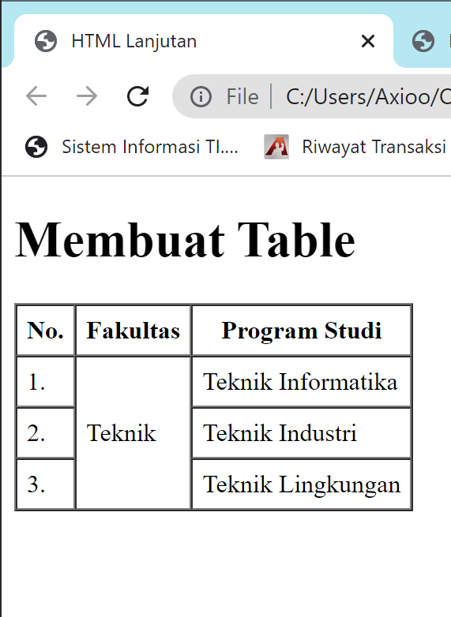

# Lab3Web

Nama : Miftahu Rizkiyah 
NIM  : 312010014 
Kelas : TI.20.B.1 
Matakuliah : Pemograman Web 

Pada Lab3Web kali ini kita akan membuat langkah-langkah praktikum lagi tentang Ordered List, Unordered List dan juga Form. 

## Membuat List HTML
Pertama kita membuat dokumen HTML nya.  

## 1. Pertama kita akan membuat ordered List

 

## 2. Kedua kita akan membuat Unordered List

 

## 3. Kita akan membuat Description List

 

## 4. Membuat Tabel

 

## 5. Lalu kita mencoba untuk menggabungkan Sel Data pada table tersebut

 

## 6. Langkah selanjutnya kita belajar untuk membuat form

 

## 7. Menambahkan style pada form tersebut

 

 

## Pertanyaan dan Tugas
- Buatlah form yang menampilkan dropdown menu dan listbox dengan multiple selection

 

 

 

Demikian tugas Lab3Web dari saya. Jika ada kesalahan mohon dimaafkan.

## Thank You

